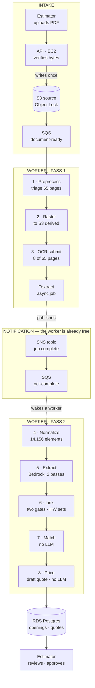

# How a bid set becomes a quote

Every AWS service the system touches, and the full journey of one PDF — from the
estimator's upload to a priced, approved quote — as the code on `main` actually
runs it today.

Section numbers refer to [the consolidated spec](CBC_Copilot_Consolidated_Spec.md).

---

# Part 1 — the services

## Six services in the request path

These are the ones application code calls directly. Every one appears as a
`boto3.client(...)` somewhere under `backend/`.

| Service | What it does here | Why this and not something else |
|---|---|---|
| **S3** | Two buckets. **Source** holds client PDFs, written once and never again. **Derived** holds page rasters, gzipped OCR JSON, and rendered quotes. | Object Lock on source is what makes a citation from six months ago still mean something (§11.3). Derived is regenerable, so it tiers to cheaper storage. |
| **SQS** | Two queues plus two dead-letter queues: `document-ready` and `ocr-complete`. | Standard, not FIFO (C6). Documents are independent, and idempotency lives in `pipeline_jobs` rather than in the transport. |
| **SNS** | One topic. Textract publishes job completion to it; it fans into the `ocr-complete` queue. | The alternative is a worker sleeping in a polling loop for minutes per document — bottleneck B2. |
| **Textract** | OCR, but only for pages triage says are worth it — `AnalyzeDocument` with TABLES for schedules, `DetectDocumentText` for prose. | Structured OCR is $15 per 1,000 pages. Most of a bid set is drawings that need none of it. |
| **Bedrock** | Extraction, in two passes. A cheap model locates which tables are schedules; a strong one reads the values and must cite its sources (§5.3). | Same account and region as the data, so drawings never leave (NFR-4). Model IDs are resolved at deploy and pinned, never hardcoded (C5). |
| **SSM** | Parameter Store. Configuration and secrets, read once at process start (§8.4). | Nothing reads a secret from a file outside local development, and no secret is baked into an image. |

## Everything else is plumbing or a guardrail

These exist in Terraform and never appear in application code.

| Service | Role |
|---|---|
| **EC2** | Two hosts. API and web on one, the pipeline worker on the other — deliberately separate, so one 200-page bid set cannot slow every estimator's page loads (§9 B1). |
| **RDS** | PostgreSQL 17. Reference library, extracted openings, provenance, quotes, audit trail. Private subnets, unreachable from outside the VPC. |
| **VPC** | Subnets, an internet gateway, and an **S3 gateway endpoint**. No NAT gateway — that is $33/month for something only S3 traffic needed (§10.3). |
| **CloudFront** | Serves page rasters. The viewer overlay is drawn client-side from 0–1 page fractions, so a click is a CDN GET rather than a PDF render on the API host (§9 B5). |
| **IAM** | Separate roles for API and worker. The API can *write* source and enqueue; the worker can *read* source, write derived, and consume. Neither can do the other's job (§11.2). |
| **CloudWatch** | Log groups at 30 / 7 / 365-day retention, plus alarms on DLQ depth, queue age, CPU credits, and extraction quality drift (§11.5). |
| **Budgets**, **Cost Explorer** | A monthly budget alerting on actual *and forecast*, plus anomaly detection — which catches a spike inside an otherwise normal month, something a budget cannot. |

### Deliberately absent

- **Lambda** — Textract plus extraction on a 200-page set exceeds the 15-minute
  ceiling, and the worker holds a PDF in memory.
- **ECS** — an orchestration layer that ten users do not need.
- **Cognito** — deferred. Django auth is the authorisation and audit boundary, and
  an identity provider can sit in front of it later without a rewrite
  ([ADR-0004](adr/0004-cognito-deferred.md)).

**DynamoDB** appears once, holding the Terraform state lock. That is build
tooling, not the application.

---

# Part 2 — the lifecycle

## The pipeline breaks in half, on purpose

The dotted path is the whole point. A worker that polled Textract would sit
blocked for minutes per document; instead it submits, releases the message, and a
completion notification wakes a later pass. The counts are from the reference
65-page bid set.

## The eight stages, in order

Each writes its own row in `pipeline_jobs`, so a restart loses nothing and the API
reads status from the same table the worker writes (§3.2 rule 2).

### 1 · Preprocess — the money step

*S3 · no OCR spend yet*

Validate the PDF, probe every page for its text layer, then classify it through
five tiers — bookmarks, title block, keyword anchors, a cheap model on a
thumbnail, manual override. A routing table held as **configuration**, not `if`
statements, decides what each page costs (`backend/config/ocr_routes.json`).

The manifest is written **before the first OCR call**, because it is the audit
answer to "why was page 47 never read?". Measured on the reference set:
**$0.12 against $0.98** to read every page.

### 2 · Raster

*S3 derived · CloudFront origin*

Render each page once, at ingest, in three tiers — a grey thumbnail, a viewer
image, and a high-resolution input for pages whose text is outlined vectors.
Never on demand.

### 3 · OCR submit

*Textract · SNS*

Per-page routing from the manifest: structured OCR for schedules, cheap text
detection for prose, the PDF's own text layer where it is rich, and nothing at all
for drawings. A `NotificationChannel` is attached so the job reports back rather
than being polled.

**Textract is handed a subset PDF, not the source document.** The routed pages are
extracted into a small PDF in the derived bucket and that is what gets submitted —
because Textract bills for every page it *processes*, so submitting the original
would pay for all 65 pages of a plan set to read the eight that carry a schedule.
On the Dutch Bros reference set that is $0.12 rather than $0.98. Routing that never
reaches the submission is a manifest annotation, not a cost decision.

Submitted page *N* maps back to the document-global page number through the sorted
routed-page list, so a citation always points at a page that means something in the
PDF the estimator is looking at (§4.6). Nothing stores the map; deriving it is what
keeps a re-run reproducing identical element identities. This also retires
splitting: a routed subset is a handful of pages, so Textract's 3,000-page limit is
enforced as a guard that refuses before spending rather than as a workflow.

The Textract job id is recorded **before** the call is treated as complete. SQS
delivers at least once, and a redelivered 3,000-page job re-submitted three times
costs $135 instead of $45 (§9 B8).

### 4 · Normalize

*RDS · bulk `COPY`*

Flatten OCR blocks into `doc_elements` with **positional** identities —
`pages/3/words/412` — because Textract mints fresh block ids on every run, and
keying citations by those would orphan every reviewed field on a re-run (§7.2).

14,156 rows in 1.8 seconds via `COPY`. Re-running reproduces an identical path
set, verified: zero missing, zero new.

### 5 · Extract

*Bedrock · two passes*

**Pass A** shows a cheap model an inventory of table headers and asks which are
schedules. On the reference set that turned **86 tables into 1**. **Pass B** then
makes one call per surviving table on the strongest available model.

Temperature is zero and the prompt is a versioned file that is never edited in
place, so a value produced six months ago can still be attributed to exact bytes
(§5.4).

### 6 · Link — where a claim becomes a fact

*RDS · the two gates*

Every field passes two checks (§5.6):

- **Citation existence** — the element ids cited must be in the set the model was
  given.
- **Value grounding** — the value must actually appear in the text of those
  elements, as a string. Never a semantic comparison.

A field failing either is rejected and flagged. Never repaired, never retried into
acceptance. Citing a real element for a value it does not contain is worse than
returning nothing, because it looks verifiable.

The same two gates then run again on a different question. A door schedule says
`HW-3`; the Division 08 spec section on another sheet defines what `HW-3` contains.
Joining them is a separate call with its own narrow context, and its answer becomes
`hardware_set_components` — each component citing its own elements, through the
identical validator. Hardware is most of a real CBC quote, so this is where most of
the lines come from (§5.11).

A callout whose definition is not in the document is written as an unresolved,
flagged row and produces no catalogue matches. Every model knows roughly what a
commercial hardware set contains, and supplying that list would look like a working
feature while putting invented parts on a priced quote.

### 7 · Match

*RDS · fully deterministic*

Hard constraints filter — fire rating, handing, CSI division. Finish, size, vendor
and stock status score. Below a cut-off it routes to the manual path rather than
proposing a line (NR-13). **No model is involved in the accept or reject
decision**, so a rejection can always say which constraint failed.

Each door is matched, and so is every component of the hardware set it calls for.
Components are matched **per opening**, not once per set, because the rating and
handing constraints belong to the door: the same `HW-3` on a 90-minute opening and
on an unrated one are two different matching problems, and a hardware schedule line
carries no certification claim of its own.

### 8 · Price

*RDS · no LLM anywhere*

The draft quote is built here, not left for the estimator to assemble: one line per
opening with that door's hardware directly beneath it, a restroom-accessories block,
and a freight line that renders `TBD`. An opening with no usable match still gets a
visible line with no price — routed to the manual path is something you can see, not
something that vanished off the quote.

Then the arithmetic: a cost waterfall in strict priority order, vendor multipliers
keyed by effective date, margin applied as a divisor, tax only for the two
jurisdictions that have rates. Every figure is **stored, not recomputed on read**, so
a quote sent last quarter still shows the numbers it was sent with (§6.2).

Regenerating is an explicit action. A second document on the same bid never rebuilds
over lines an estimator has been editing.

## After the pipeline

The estimator reviews the openings grid, clicking any value to see the exact page
region it came from. Every edit writes a `feedback` row carrying the before, the
after, and who changed it — that table is simultaneously the audit trail, the
tuning dataset, and the source of new golden-set cases (FR-13).

Approval is a hard gate: there is no export path that does not pass through it
(NFR-1). Export itself is **enqueued, not rendered in the request** — the second
asynchronous break — so a PDF render never blocks the estimator's browser
(§9 B14). The finished quote lands in the derived bucket and is sent to the person
who started the job.

## What runs instead, locally

The whole loop runs offline with no AWS account. MiniStack stands in for S3, SQS,
SNS and Parameter Store, and `FAKE_OCR=1` synthesises Textract-shaped blocks from
the PDF's own text layer — real geometry, real table structure, no spend (§8.3).

> **Bedrock is the one thing with no local substitute.** It is not emulated, and
> the endpoint override is scoped by service so it can never be pointed at the
> emulator by accident. An emulator that answers a Bedrock call with a plausible
> mock does not fail loudly — it produces an extraction that looks like it worked.

## Four invariants worth knowing

- **The source document is written once and never mutated.** Repairs and rasters
  go to the derived bucket. Verified byte-identical after a full run.
- **Django owns the schema.** The worker reads and writes Django-migrated tables
  and never runs a migration. `test_schema_parity.py` asserts the two views agree,
  so drift fails the build ([ADR-0001](adr/0001-django-owns-schema.md)).
- **Absence is recorded, not inferred.** A missing fire rating is a finding an
  estimator must confirm — never carried down from the row above, and never
  silently treated as "unrated" (§5.8).
- **Cost is guarded before it is spent.** `MAX_OCR_COST_PER_DOCUMENT_USD` is
  checked against the manifest before the first OCR call, not discovered on the
  bill.
